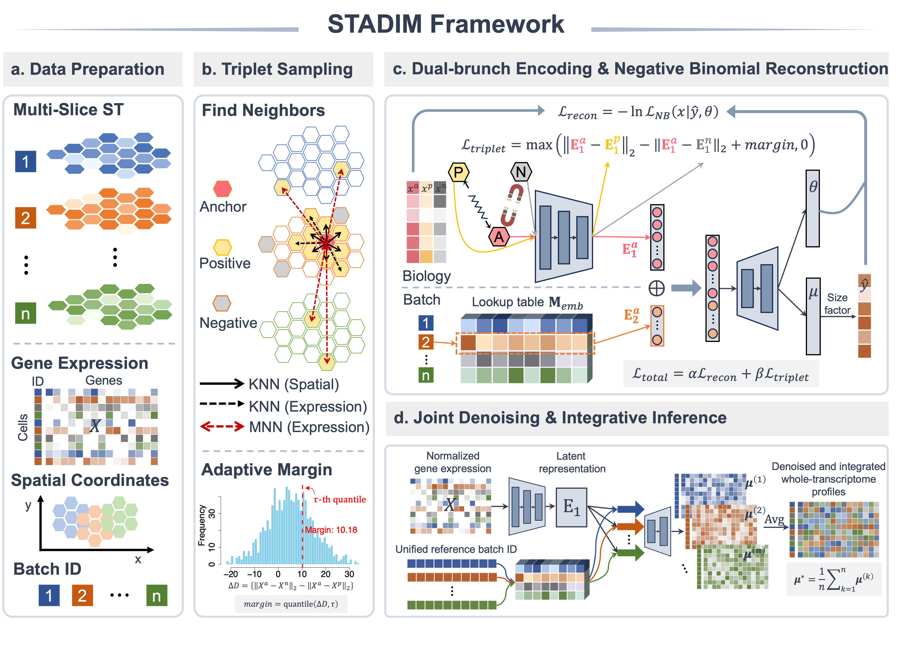

Welcome to STADIM's documentation!
==================================

STADIM: Adaptive Deep Metric Learning for Denoising and Integration of Multi-Slice Spatial Transcriptomics
==========================================================================================================

.. toctree::
   :maxdepth: 1

   Tutorial1_Single_DLPFC
   Tutorial2_Multi_DLPFC
   Tutorial3_Multi_MB
   Tutorial4_Multi_MOB
   Tutorial5_Multi_MB_SCP1375
   Tutorial6_Multi_VisiumHD

Overview of STADIM
==================

**a, Data preparation.** STADIM takes multi-slice joint ST data as input, including a combined gene expression matrix, spatial coordinates, and batch IDs for all spots. **b, Triplet sampling strategy.** For each anchor spot, within-slice and cross-slice positives are identified based on spatial and transcriptomic similarity, while negatives are randomly sampled from non-neighboring spots within the same slice. Utilizing the input data, an adaptive margin (τ-th quantile) is precomputed from triplet distance distributions to guide training. **c, Dual-branch encoding and NB reconstruction.** A dual-branch encoder architecture separates biological signals from technical variation: the biology branch learns low-dimensional embeddings that capture intrinsic gene expression patterns, while the batch branch encodes batch-specific features via a lookup table. The concatenated representations are decoded to estimate parameters of an NB distribution. **d, Joint denoising and integrative inference.** During inference, embeddings are decoded across all batch IDs under a unified reference, and predictions are averaged to generate a batch-corrected, denoised, and high-fidelity transcriptome-wide expression matrix.

Installation
============

.. code-block:: bash

   # Create a new environment
   conda create -n stadim python=3.9 -y
   conda activate stadim

   # Install STADIM directly from GitHub
   pip install git+https://github.com/xiaoshutong273/STADIM.git

   # To use the environment in jupyter notebook, add python kernel for this environment.
   pip install ipykernel
   python -m ipykernel install --user --name=STADIM